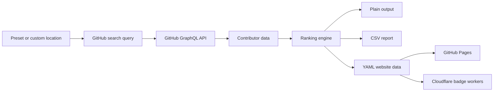

<p align="center">
  
</p>

<h1 align="center">Re-design committers.top</h1>

<p align="center">
  <strong>A polished Go-powered GitHub ranking pipeline for finding the most active contributors by region.</strong>
</p>

<p align="center">
  
  
  
  
</p>

<p align="center">
  <a href="#quick-start">Quick start</a>
  &middot;
  <a href="#features">Features</a>
  &middot;
  <a href="#architecture">Architecture</a>
  &middot;
  <a href="#cli-reference">CLI reference</a>
  &middot;
  <a href="#deployment">Deployment</a>
</p>

## What This Project Does

`committers.top` is a command line tool that asks the GitHub GraphQL API for users, collects contribution data, and ranks developers by activity. It can generate terminal output, CSV reports, YAML data for a website, and rank data for badge workers.

The animated 3D-style banner is built as an SVG because GitHub READMEs do not allow JavaScript, canvas, or WebGL scenes.

## Features

| Capability | Details |
| --- | --- |
| Regional rankings | Query users by preset countries, regions, or custom locations. |
| Contribution intelligence | Rank by commits, public contributions, private-inclusive totals, and organization membership. |
| GitHub GraphQL integration | Pulls profile, follower, organization, avatar, and contribution data from GitHub. |
| Multiple exports | Generate `plain`, `csv`, or `yaml` output from the same CLI. |
| Website-ready data | YAML output can feed the `gh-pages` website branch. |
| Badge support | Cloudflare Worker badge tooling is included under `badges/`. |
| Container support | Build and run the CLI with the included `Dockerfile`. |

## Quick Start

Create a GitHub token with `read:user` and `read:org` permissions, then run:

```powershell
$env:GITHUB_TOKEN="paste-your-token-here"
go run . --preset worldwide --amount 50 --consider 250
```

Save a CSV report:

```powershell
go run . `
  --preset worldwide `
  --amount 500 `
  --consider 1000 `
  --output csv `
  --file ./output.csv
```

Query a custom location:

```powershell
go run . --location Baghdad --location Iraq --amount 25 --consider 100
```

List every bundled preset:

```powershell
go run . --list-presets
```

## Example Output

```text
USERS
--------
#1: Example Developer (example):42810 (@example) org-one,org-two
#2: Core Maintainer (maintainer):37460 (@company) org-three

ORGANIZATIONS
--------
#1: example-org (12)
#2: tooling-labs (7)
```

CSV output:

```csv
rank,name,login,contributions,company,organizations
1,Example Developer,example,42810,@example,"org-one,org-two"
```

## Architecture



## CLI Reference

| Flag | Default | Purpose |
| --- | --- | --- |
| `--token` | `$GITHUB_TOKEN` | GitHub API token. |
| `--preset` | empty | Named preset from `presets.go`, such as `worldwide`, `iraq`, or `united states`. |
| `--location` | empty | Free-text GitHub location filter. Can be repeated. |
| `--amount` | `256` | Number of ranked users to print or export. |
| `--consider` | `1000` | Number of search results to inspect before ranking. |
| `--output` | `plain` | Output format: `plain`, `csv`, or `yaml`. |
| `--file` | stdout | Optional output file. |
| `--list-presets` | `false` | Print available presets as CSV and exit. |

## Project Structure

```text
.
|-- main.go              # CLI entry point and flags
|-- presets.go           # Region preset definitions
|-- github/github.go     # GitHub REST and GraphQL client
|-- top/top.go           # Query building and ranking entry point
|-- output/output.go     # Plain, CSV, and YAML renderers
|-- net/net.go           # HTTP wrappers and token auth
|-- badges/              # Cloudflare Worker badge tooling
|-- assets/              # README visual assets
`-- Dockerfile           # Container image definition
```

## Deployment

Build with Docker:

```powershell
docker build -t committers-top .
```

Run with Docker:

```powershell
docker run --rm `
  -e GITHUB_TOKEN="$env:GITHUB_TOKEN" `
  committers-top `
  --preset worldwide `
  --amount 50 `
  --consider 250
```

The public website is generated from a separate `gh-pages` branch. To inspect it locally:

```powershell
git fetch origin gh-pages
git worktree add ../committers.top-gh-pages origin/gh-pages
cd ../committers.top-gh-pages
bundle install
bundle exec jekyll serve
```

Open `http://127.0.0.1:4000` after Jekyll starts.

## Badge Workers

The `badges/` folder contains Cloudflare Worker scripts that embed generated ranking data and render badges through Shields.

Required environment variables:

```text
CLOUDFLARE_API_TOKEN
CLOUDFLARE_ACCOUNT_ID
```

See [`badges/README.md`](./badges/README.md) for the full badge deployment flow.

## Development

Run the normal Go checks before committing:

```powershell
go fmt ./...
go vet ./...
go test ./...
```

Optional pre-commit hooks:

```powershell
pre-commit install
pre-commit run --all-files
```

## Notes

GitHub does not let user search results be sorted directly by contribution count. This project first gathers a broad candidate list sorted by followers, then ranks that candidate set using contribution data from the API.

GitHub profile locations are free text, so region matching depends on what users write in their profiles. Presets can be expanded when a country or region needs more location aliases.

Private contribution totals depend on GitHub API visibility and user settings. The project exposes public and private-inclusive views where that data is available.

## Credits

This project is based on the idea from [`lauripiispanen/most-active-github-users-counter`](https://github.com/lauripiispanen/most-active-github-users-counter) and the continued `committers.top` data pipeline.

## License

Released under the MIT License. See [`LICENSE`](./LICENSE).
