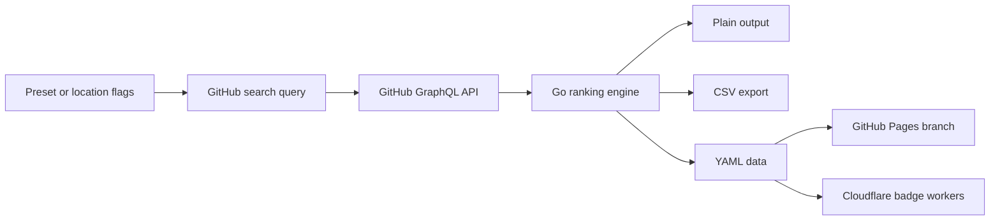

<p align="center">
  
</p>

<h1 align="center">committers.top</h1>

<p align="center">
  <strong>Rank the most active GitHub users by location, public contribution activity, private contribution activity, and organization presence.</strong>
</p>

<p align="center">
  
  
  
  
</p>

## Overview

`committers.top` is a Go CLI and GitHub Pages data pipeline for discovering active GitHub users across preset regions. It queries the GitHub GraphQL API, ranks users by contribution signals, exports machine-readable data, and powers the public website and badge endpoints.

GitHub READMEs cannot run real JavaScript or WebGL scenes, so the banner above is a GitHub-safe animated SVG with a 3D-style data pipeline. It will render directly after you push the repository.

## Features

| Area | What it does |
| --- | --- |
| GitHub search | Uses GitHub GraphQL search sorted by followers to collect candidate users. |
| Ranking | Sorts users by commits, public contributions, public plus private contributions, and organizations. |
| Presets | Ships with country and region presets in `presets.go`. |
| Outputs | Supports `plain`, `csv`, and `yaml` exports. |
| Website data | Produces YAML consumed by the `gh-pages` branch. |
| Badges | Includes Cloudflare Worker badge tooling under `badges/`. |
| Docker | Provides a small scratch-based runtime image. |

## Quick Start

Create a GitHub personal access token with `read:user` and `read:org` permissions, then run the CLI:

```powershell
$env:GITHUB_TOKEN="paste-your-token-here"
go run . --preset worldwide --amount 50 --consider 250 --output plain
```

Write CSV output to a file:

```powershell
go run . `
  --preset worldwide `
  --amount 500 `
  --consider 1000 `
  --output csv `
  --file ./output.csv
```

Use explicit locations instead of a preset:

```powershell
go run . --location Baghdad --location Iraq --amount 25 --consider 100 --output plain
```

List all available presets:

```powershell
go run . --list-presets
```

## CLI Reference

| Flag | Default | Description |
| --- | --- | --- |
| `--token` | `$GITHUB_TOKEN` | GitHub API token. |
| `--preset` | empty | Preset region name, such as `worldwide`, `iraq`, or `united states`. |
| `--location` | empty | Free-text GitHub location query. Can be repeated. |
| `--amount` | `256` | Number of ranked users to include in output. |
| `--consider` | `1000` | Number of GitHub users to collect before ranking. |
| `--output` | `plain` | Output format: `plain`, `csv`, or `yaml`. |
| `--file` | stdout | Optional output file path. |
| `--list-presets` | `false` | Print preset metadata and exit. |

## Output Formats

Plain output is designed for quick terminal inspection:

```text
USERS
--------
#1: Example Name (example):12345 (@example) org-a,org-b

ORGANIZATIONS
--------
#1: example-org (7)
```

CSV output is useful for spreadsheets:

```csv
rank,name,login,contributions,company,organizations
1,Example Name,example,12345,@example,"org-a,org-b"
```

YAML output is used by the website branch and includes multiple ranked lists, organization summaries, generated timestamps, and preset metadata.

## Architecture



## Project Layout

```text
.
|-- main.go              # CLI entry point and flag parsing
|-- presets.go           # Region presets and checksums
|-- github/github.go     # GitHub REST and GraphQL client
|-- top/top.go           # Search query assembly and ranking entry point
|-- output/output.go     # Plain, CSV, and YAML renderers
|-- net/net.go           # HTTP wrappers and token auth
|-- badges/              # Cloudflare Worker badge deployment
|-- assets/              # README visual assets
`-- Dockerfile           # Container build
```

## Website Branch

The browser site is generated from the separate `gh-pages` branch. The `master` branch is the CLI and data generator; the website branch consumes generated YAML files and publishes the public pages.

To inspect the website source locally:

```powershell
git fetch origin gh-pages
git worktree add ../committers.top-gh-pages origin/gh-pages
cd ../committers.top-gh-pages
```

If Ruby and Bundler are installed, serve it with:

```powershell
bundle install
bundle exec jekyll serve
```

Then open `http://127.0.0.1:4000`.

## Docker

Build the image:

```powershell
docker build -t committers-top .
```

Run the CLI:

```powershell
docker run --rm `
  -e GITHUB_TOKEN="$env:GITHUB_TOKEN" `
  committers-top `
  --preset worldwide `
  --amount 50 `
  --consider 250 `
  --output plain
```

## Badges

The `badges/` directory contains Cloudflare Worker deployment tooling. During deployment, rank data is embedded into worker scripts and Shields is used for badge rendering.

Required environment variables:

```text
CLOUDFLARE_API_TOKEN
CLOUDFLARE_ACCOUNT_ID
```

Read the badge deployment details in [`badges/README.md`](./badges/README.md).

## Development

Run the standard Go checks before pushing:

```powershell
go fmt ./...
go vet ./...
go test ./...
```

The repository also includes pre-commit configuration:

```powershell
pre-commit install
pre-commit run --all-files
```

## FAQ

### Why do results depend on followers?

GitHub does not provide a direct way to search users sorted by contribution count. The tool first collects candidates sorted by followers, then ranks that candidate set by contribution data.

### Why is someone missing from a region?

GitHub profile locations are free text. A user may be missing if their profile does not include a matching city, country, or region name. Rural or uncommon spellings may need extra preset entries.

### Why are contribution numbers different from a GitHub profile?

GitHub profiles can display public-only or public plus private contribution totals depending on user settings. This project exposes public and public-plus-private ranking views where the GitHub API provides the data.

You can verify your own API values with GitHub's GraphQL Explorer:

```graphql
query {
  viewer {
    login
    contributionsCollection {
      restrictedContributionsCount
      contributionCalendar {
        totalContributions
      }
    }
  }
}
```

## Contributing

Pull requests are welcome. For code changes, run `go fmt`, `go vet`, and `go test ./...` before submitting.

For changes to `presets.go`, also verify the generated website data on your fork's `gh-pages` branch and reference the generated commit in the pull request so reviewers can see the rendered impact.

## Credits

This project continues the idea from [`lauripiispanen/most-active-github-users-counter`](https://github.com/lauripiispanen/most-active-github-users-counter) and publishes the results through `committers.top`.

## License

Distributed under the MIT License. See [`LICENSE`](./LICENSE) for details.
